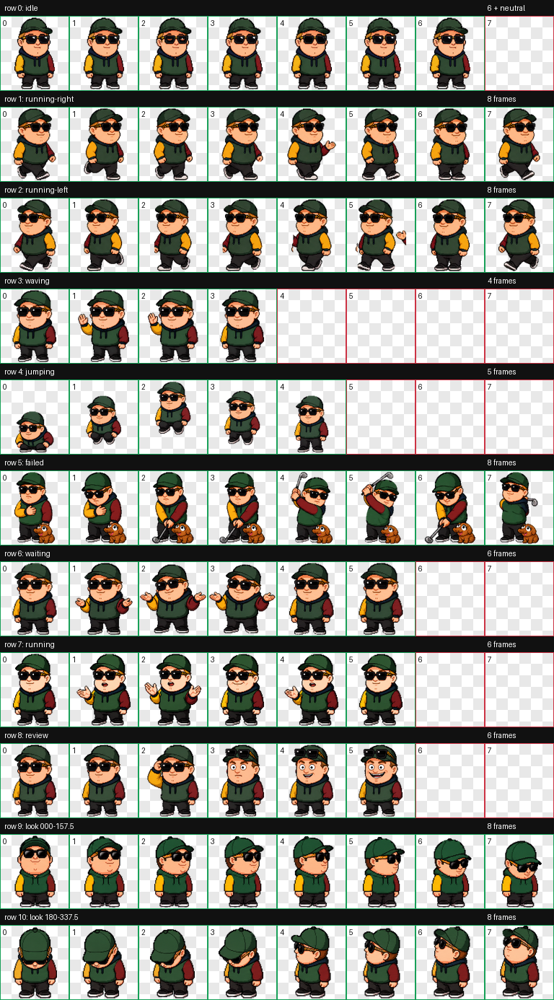

# Tim Dillon Codex Pet

An unofficial, fan-made pixel-art parody and tribute to comedian and podcaster Tim Dillon.

> [!IMPORTANT]
> This project is not affiliated with, authorized by, sponsored by, or endorsed by Tim Dillon, his podcast, his representatives, or any associated rights holder. No endorsement is implied.



## About

This Codex/Petdex/Hermes-compatible v2 pet is a compact 16-bit bobblehead interpretation built around recognizable comedic mannerisms and podcast references:

- oversized designer sunglasses and rotating podcast-era outfits
- a frozen, wide-eyed smile used as an expression payoff
- a “life in the big city” shrug
- a “we wish her well” golf sequence
- a small Snuffleupagus-inspired stuffed-animal easter egg

Neutral frames use a cleaner face. Dimples appear selectively during stronger smiles and expressions.

## Package

The installable package lives at the repository root:

```text
pet.json
spritesheet.webp
```

The spritesheet is a Codex v2 RGBA atlas: 1536×2288 pixels, eight columns, eleven rows, and 192×208-pixel cells. It contains all nine standard animation states plus sixteen clockwise look directions.

## Install locally

Clone the repository, then copy the package into any supported runtime:

```bash
git clone https://github.com/mattpetters/tim-dillon-codex-pet.git
cd tim-dillon-codex-pet

mkdir -p ~/.codex/pets/tim-dillon
cp pet.json spritesheet.webp ~/.codex/pets/tim-dillon/
```

Petdex Desktop uses `~/.petdex/pets/tim-dillon/`, and Hermes uses `~/.hermes/pets/tim-dillon/` with the same two files.

The package was submitted to Petdex as `tim-dillon` on August 23, 2026 and is currently held for human policy review. If approved, the one-command install will be:

```bash
npx petdex install tim-dillon
```

## Fan-work notice

Tim Dillon’s name and likeness are used only to identify the subject of this non-commercial fan parody/tribute. The artwork is stylized and transformative; it is not official merchandise and should not be presented as an authentic Tim Dillon product or endorsement. See [DISCLAIMER.md](DISCLAIMER.md).

## License

To the extent the repository owner can license the original pixel artwork and metadata, they are available for personal, non-commercial fan use under [CC BY-NC 4.0](LICENSE.md). This license does not grant rights in any third-party name, likeness, trademark, show, character, catchphrase, or other protected material.
